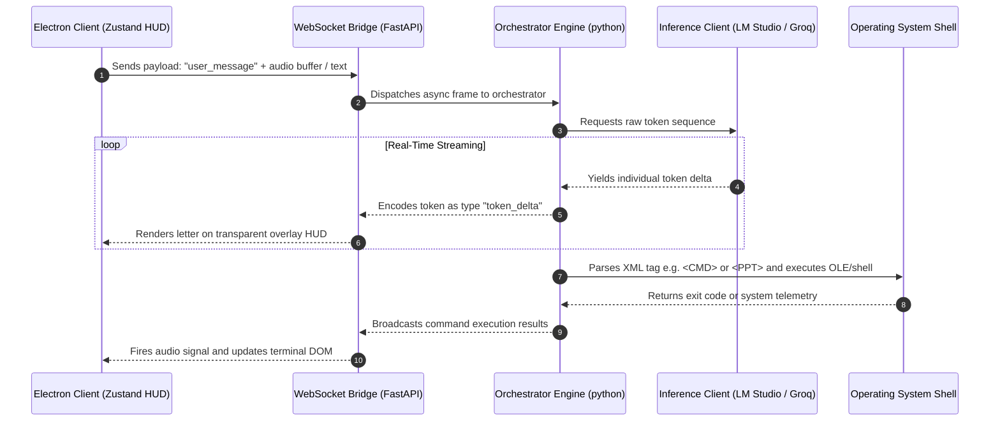

<div align="center">

<!-- Astro-themed Glowing Banner -->


<p align="center">
  
  
  
  
</p>

</div>

---

<!-- Glassmorphic System Status Dashboard -->
<div style="background: linear-gradient(135deg, rgba(10, 10, 10, 0.9) 0%, rgba(20, 20, 20, 0.8) 100%); border: 1px solid rgba(0, 229, 255, 0.25); border-radius: 16px; padding: 25px; margin: 20px 0; box-shadow: 0 8px 32px 0 rgba(0, 229, 255, 0.15); backdrop-filter: blur(20px);">
  <h2 style="color: #00E5FF; font-family: 'Orbitron', sans-serif; margin-top: 0; display: flex; align-items: center; gap: 10px;">
    <span>⚡</span> CORE DIRECTIVE: ASTRYX HUD
  </h2>
  <p style="color: #e0e0e0; line-height: 1.6; font-size: 15px;">
    Astryx is a zero-latency, transparent, glassmorphic desktop operating HUD. By linking an asynchronous Python backend directly with a hardware-accelerated Electron shell via WebSockets, Astryx executes spatial AR mappings, multi-agent coding swarms, and native desktop COM automation in real-time.
  </p>
  
  <!-- Mini Grid -->
  <div style="display: grid; grid-template-columns: repeat(auto-fit, minmax(200px, 1fr)); gap: 15px; margin-top: 20px;">
    <div style="background: rgba(255, 255, 255, 0.03); border: 1px solid rgba(255, 255, 255, 0.08); border-radius: 8px; padding: 12px; text-align: center;">
      <div style="color: #888; font-size: 11px; text-transform: uppercase;">RESPONSE SPEED</div>
      <div style="color: #00E5FF; font-size: 22px; font-weight: bold; margin-top: 4px;">&lt; 15ms</div>
    </div>
    <div style="background: rgba(255, 255, 255, 0.03); border: 1px solid rgba(255, 255, 255, 0.08); border-radius: 8px; padding: 12px; text-align: center;">
      <div style="color: #888; font-size: 11px; text-transform: uppercase;">COGNITIVE CORES</div>
      <div style="color: #10B981; font-size: 22px; font-weight: bold; margin-top: 4px;">50 Active</div>
    </div>
    <div style="background: rgba(255, 255, 255, 0.03); border: 1px solid rgba(255, 255, 255, 0.08); border-radius: 8px; padding: 12px; text-align: center;">
      <div style="color: #888; font-size: 11px; text-transform: uppercase;">STATE MIXING</div>
      <div style="color: #A855F7; font-size: 22px; font-weight: bold; margin-top: 4px;">Zustand Sync</div>
    </div>
    <div style="background: rgba(255, 255, 255, 0.03); border: 1px solid rgba(255, 255, 255, 0.08); border-radius: 8px; padding: 12px; text-align: center;">
      <div style="color: #888; font-size: 11px; text-transform: uppercase;">UI ENGINE</div>
      <div style="color: #F59E0B; font-size: 22px; font-weight: bold; margin-top: 4px;">120Hz Smooth</div>
    </div>
  </div>
</div>

---

## 🚀 THE 50 ACTIVE INTELLIGENCE FEATURES

Astryx runs a highly structured registry of **50 high-intelligence autonomous operations** mapped across 5 specific operational tabs.

<div style="display: grid; grid-template-columns: 1fr; gap: 20px;">

  <!-- Category A -->
  <div style="border: 1px solid rgba(0, 229, 255, 0.15); border-radius: 12px; padding: 20px; background: rgba(255,255,255,0.01);">
    <h3 style="color: #00E5FF; margin-top: 0; font-family: 'Orbitron', sans-serif;">💻 NODE A: COGNITIVE SANDBOX (Coding Systems)</h3>
    <table width="100%" style="border-collapse: collapse; margin-top: 10px;">
      <tr style="border-bottom: 1px solid rgba(255,255,255,0.05);">
        <td width="30%" style="color: #00e5ff; font-weight: bold; padding: 8px 0;">1. Antigravity IDE</td>
        <td style="color: #ccc; padding: 8px 0;">Monolithic editor with dynamic tree mapping, file diff highlighting, and multi-file views.</td>
      </tr>
      <tr style="border-bottom: 1px solid rgba(255,255,255,0.05);">
        <td style="color: #00e5ff; font-weight: bold; padding: 8px 0;">2. Agentic Coding Swarm</td>
        <td style="color: #ccc; padding: 8px 0;">Hierarchical agent swarms communicating synchronously to write, review, and patch structures.</td>
      </tr>
      <tr style="border-bottom: 1px solid rgba(255,255,255,0.05);">
        <td style="color: #00e5ff; font-weight: bold; padding: 8px 0;">3. Code Sandbox Engine</td>
        <td style="color: #ccc; padding: 8px 0;">Secure local subprocess isolation running Node and Python files.</td>
      </tr>
      <tr style="border-bottom: 1px solid rgba(255,255,255,0.05);">
        <td style="color: #00e5ff; font-weight: bold; padding: 8px 0;">4. Log Terminal Interceptor</td>
        <td style="color: #ccc; padding: 8px 0;">Pipes live execution logs (stdout/stderr) directly into the agent reasoning context.</td>
      </tr>
      <tr style="border-bottom: 1px solid rgba(255,255,255,0.05);">
        <td style="color: #00e5ff; font-weight: bold; padding: 8px 0;">5. Compiler Self-Correction</td>
        <td style="color: #ccc; padding: 8px 0;">Recursively inspects stack traces and rewrites buggy code blocks until successful validation.</td>
      </tr>
      <tr style="border-bottom: 1px solid rgba(255,255,255,0.05);">
        <td style="color: #00e5ff; font-weight: bold; padding: 8px 0;">6. Code Explainer (`code_explainer.py`)</td>
        <td style="color: #ccc; padding: 8px 0;">Translates codebases into clean block-by-block and line-by-line semantic reviews.</td>
      </tr>
      <tr style="border-bottom: 1px solid rgba(255,255,255,0.05);">
        <td style="color: #00e5ff; font-weight: bold; padding: 8px 0;">7. Code Reviewer (`code_reviewer.py`)</td>
        <td style="color: #ccc; padding: 8px 0;">Scour code files for performance bottlenecks, style issues, and security vulnerabilities.</td>
      </tr>
      <tr style="border-bottom: 1px solid rgba(255,255,255,0.05);">
        <td style="color: #00e5ff; font-weight: bold; padding: 8px 0;">8. Interactive Compiler Display</td>
        <td style="color: #ccc; padding: 8px 0;">Visual compilation outputs inside the Electron interface without secondary windows.</td>
      </tr>
      <tr style="border-bottom: 1px solid rgba(255,255,255,0.05);">
        <td style="color: #00e5ff; font-weight: bold; padding: 8px 0;">9. Code Minifier Console</td>
        <td style="color: #ccc; padding: 8px 0;">Compresses JS/CSS payloads, giving relative sizing and efficiency metrics.</td>
      </tr>
      <tr style="border-bottom: 1px solid rgba(255,255,255,0.05);">
        <td style="color: #00e5ff; font-weight: bold; padding: 8px 0;">10. DevOps Console Integration</td>
        <td style="color: #ccc; padding: 8px 0;">Renders git tree states and local Docker container health visually on the panel.</td>
      </tr>
    </table>
  </div>

  <!-- Category B -->
  <div style="border: 1px solid rgba(16, 185, 129, 0.15); border-radius: 12px; padding: 20px; background: rgba(255,255,255,0.01);">
    <h3 style="color: #10B981; margin-top: 0; font-family: 'Orbitron', sans-serif;">🎙️ NODE B: ACOUSTIC INTELLIGENCE (Voice & Sound)</h3>
    <table width="100%" style="border-collapse: collapse; margin-top: 10px;">
      <tr style="border-bottom: 1px solid rgba(255,255,255,0.05);">
        <td width="30%" style="color: #10B981; font-weight: bold; padding: 8px 0;">11. Live Audio Tracker</td>
        <td style="color: #ccc; padding: 8px 0;">Dual channel system and microphone audio processing using advanced browser APIs.</td>
      </tr>
      <tr style="border-bottom: 1px solid rgba(255,255,255,0.05);">
        <td style="color: #10B981; font-weight: bold; padding: 8px 0;">12. Spectral visualizer canvas</td>
        <td style="color: #ccc; padding: 8px 0;">Continuous 60FPS Fourier transform frequency and wave visualizer on HUD canvas.</td>
      </tr>
      <tr style="border-bottom: 1px solid rgba(255,255,255,0.05);">
        <td style="color: #10B981; font-weight: bold; padding: 8px 0;">13. real-time Markdown Synthesis</td>
        <td style="color: #ccc; padding: 8px 0;">Assembles incoming transcription vectors into organized markdown notes.</td>
      </tr>
      <tr style="border-bottom: 1px solid rgba(255,255,255,0.05);">
        <td style="color: #10B981; font-weight: bold; padding: 8px 0;">14. Voice Activity Detection (VAD)</td>
        <td style="color: #ccc; padding: 8px 0;">Mathematical silence filtering inside Python ring buffers to optimize latency.</td>
      </tr>
      <tr style="border-bottom: 1px solid rgba(255,255,255,0.05);">
        <td style="color: #10B981; font-weight: bold; padding: 8px 0;">15. local Speech-to-Text</td>
        <td style="color: #ccc; padding: 8px 0;">Fast local GGUF transcribing backed by `faster-whisper`.</td>
      </tr>
      <tr style="border-bottom: 1px solid rgba(255,255,255,0.05);">
        <td style="color: #10B981; font-weight: bold; padding: 8px 0;">16. Voice Profile Library</td>
        <td style="color: #ccc; padding: 8px 0;">Pre-configured synthetic neural voices (casual, executive, diagnostic).</td>
      </tr>
      <tr style="border-bottom: 1px solid rgba(255,255,255,0.05);">
        <td style="color: #10B981; font-weight: bold; padding: 8px 0;">17. Pitch & Speed Modulator</td>
        <td style="color: #ccc; padding: 8px 0;">Adjusts vocal tone ranges and speed margins natively via Zustand.</td>
      </tr>
      <tr style="border-bottom: 1px solid rgba(255,255,255,0.05);">
        <td style="color: #10B981; font-weight: bold; padding: 8px 0;">18. Pronunciation Adjuster</td>
        <td style="color: #ccc; padding: 8px 0;">Custom SQLite mapping to correct voice-to-text spelling anomalies.</td>
      </tr>
      <tr style="border-bottom: 1px solid rgba(255,255,255,0.05);">
        <td style="color: #10B981; font-weight: bold; padding: 8px 0;">19. Audio EQ Decibel Mixer</td>
        <td style="color: #ccc; padding: 8px 0;">Multi-band physical graphic equalizer rendering custom responsive frequencies.</td>
      </tr>
      <tr style="border-bottom: 1px solid rgba(255,255,255,0.05);">
        <td style="color: #10B981; font-weight: bold; padding: 8px 0;">20. Voice Learning Engine</td>
        <td style="color: #ccc; padding: 8px 0;">Adapts sound levels dynamically based on ambient background noise metrics.</td>
      </tr>
    </table>
  </div>

  <!-- Category C -->
  <div style="border: 1px solid rgba(168, 85, 247, 0.15); border-radius: 12px; padding: 20px; background: rgba(255,255,255,0.01);">
    <h3 style="color: #A855F7; margin-top: 0; font-family: 'Orbitron', sans-serif;">📊 NODE C: HEURISTIC AUTOMATIONS (Productivity)</h3>
    <table width="100%" style="border-collapse: collapse; margin-top: 10px;">
      <tr style="border-bottom: 1px solid rgba(255,255,255,0.05);">
        <td width="30%" style="color: #A855F7; font-weight: bold; padding: 8px 0;">21. PPT OLE Generator</td>
        <td style="color: #ccc; padding: 8px 0;">Hooks directly into Microsoft PowerPoint via `win32com.client` OLE COM.</td>
      </tr>
      <tr style="border-bottom: 1px solid rgba(255,255,255,0.05);">
        <td style="color: #A855F7; font-weight: bold; padding: 8px 0;">22. Design Matrix Stylist</td>
        <td style="color: #ccc; padding: 8px 0;">Injects premium layout CSS/XML matrices dynamically during slide creation.</td>
      </tr>
      <tr style="border-bottom: 1px solid rgba(255,255,255,0.05);">
        <td style="color: #A855F7; font-weight: bold; padding: 8px 0;">23. Presentation Slide Bridge</td>
        <td style="color: #ccc; padding: 8px 0;">Constructs automatic aesthetic slide transitions and logical connectors.</td>
      </tr>
      <tr style="border-bottom: 1px solid rgba(255,255,255,0.05);">
        <td style="color: #A855F7; font-weight: bold; padding: 8px 0;">24. Design Trend Crawler</td>
        <td style="color: #ccc; padding: 8px 0;">Scrapes Behance, Dribbble, and Reddit for fresh UI trends in design.</td>
      </tr>
      <tr style="border-bottom: 1px solid rgba(255,255,255,0.05);">
        <td style="color: #A855F7; font-weight: bold; padding: 8px 0;">25. Design Trend Predictor</td>
        <td style="color: #ccc; padding: 8px 0;">Uses data analysis models to predict visual style trends.</td>
      </tr>
      <tr style="border-bottom: 1px solid rgba(255,255,255,0.05);">
        <td style="color: #A855F7; font-weight: bold; padding: 8px 0;">26. Live Dashboard Generator</td>
        <td style="color: #ccc; padding: 8px 0;">Builds standalone HTML dashboards with interactive widgets on the fly.</td>
      </tr>
      <tr style="border-bottom: 1px solid rgba(255,255,255,0.05);">
        <td style="color: #A855F7; font-weight: bold; padding: 8px 0;">27. Personal Finance DB</td>
        <td style="color: #ccc; padding: 8px 0;">SQLite ledger tracker to log crypto holdings and daily balances.</td>
      </tr>
      <tr style="border-bottom: 1px solid rgba(255,255,255,0.05);">
        <td style="color: #A855F7; font-weight: bold; padding: 8px 0;">28. Personal Health Dashboard</td>
        <td style="color: #ccc; padding: 8px 0;">Logs hydration, workout routines, and medication cycles.</td>
      </tr>
      <tr style="border-bottom: 1px solid rgba(255,255,255,0.05);">
        <td style="color: #A855F7; font-weight: bold; padding: 8px 0;">29. IoT Smart Home Daemon</td>
        <td style="color: #ccc; padding: 8px 0;">Coordinates local IoT state properties via visual command switches.</td>
      </tr>
      <tr style="border-bottom: 1px solid rgba(255,255,255,0.05);">
        <td style="color: #A855F7; font-weight: bold; padding: 8px 0;">30. Unsplash Fetch Cache</td>
        <td style="color: #ccc; padding: 8px 0;">Pre-fetches stock graphics matched to PPT layout metadata structures.</td>
      </tr>
    </table>
  </div>

  <!-- Category D -->
  <div style="border: 1px solid rgba(245, 158, 11, 0.15); border-radius: 12px; padding: 20px; background: rgba(255,255,255,0.01);">
    <h3 style="color: #F59E0B; margin-top: 0; font-family: 'Orbitron', sans-serif;">📐 NODE D: SPATIAL COMPUTING (Graphics & AR)</h3>
    <table width="100%" style="border-collapse: collapse; margin-top: 10px;">
      <tr style="border-bottom: 1px solid rgba(255,255,255,0.05);">
        <td width="30%" style="color: #F59E0B; font-weight: bold; padding: 8px 0;">31. Spatial Wall Mapper</td>
        <td style="color: #ccc; padding: 8px 0;">Renders an isometric grid layout matching webcam tracking inputs.</td>
      </tr>
      <tr style="border-bottom: 1px solid rgba(255,255,255,0.05);">
        <td style="color: #F59E0B; font-weight: bold; padding: 8px 0;">32. Radar Target Sweeper</td>
        <td style="color: #ccc; padding: 8px 0;">Interactive HUD radar scanner simulating active host topology sweeps.</td>
      </tr>
      <tr style="border-bottom: 1px solid rgba(255,255,255,0.05);">
        <td style="color: #F59E0B; font-weight: bold; padding: 8px 0;">33. Dreamscape Simulator</td>
        <td style="color: #ccc; padding: 8px 0;">Spawns customizable particle systems responding to CPU load metrics.</td>
      </tr>
      <tr style="border-bottom: 1px solid rgba(255,255,255,0.05);">
        <td style="color: #F59E0B; font-weight: bold; padding: 8px 0;">34. Celestial Starmap NAV</td>
        <td style="color: #ccc; padding: 8px 0;">Simulation chart of astronomical bodies, dynamically plotting space paths.</td>
      </tr>
      <tr style="border-bottom: 1px solid rgba(255,255,255,0.05);">
        <td style="color: #F59E0B; font-weight: bold; padding: 8px 0;">35. Mood Mirror AR Engine</td>
        <td style="color: #ccc; padding: 8px 0;">Uses camera inputs to scan micro-expressions and display mood indices.</td>
      </tr>
      <tr style="border-bottom: 1px solid rgba(255,255,255,0.05);">
        <td style="color: #F59E0B; font-weight: bold; padding: 8px 0;">36. Imagen Vector Engine</td>
        <td style="color: #ccc; padding: 8px 0;">Produces custom SVGs programmatically when API generation fails.</td>
      </tr>
      <tr style="border-bottom: 1px solid rgba(255,255,255,0.05);">
        <td style="color: #F59E0B; font-weight: bold; padding: 8px 0;">37. Particle Lab Sandbox</td>
        <td style="color: #ccc; padding: 8px 0;">Custom gravitational field testing sandbox using Vector Canvas engines.</td>
      </tr>
      <tr style="border-bottom: 1px solid rgba(255,255,255,0.05);">
        <td style="color: #F59E0B; font-weight: bold; padding: 8px 0;">38. Screen Grab OCR Engine</td>
        <td style="color: #ccc; padding: 8px 0;">Takes system viewport snaps to run optical character recognition pipelines.</td>
      </tr>
      <tr style="border-bottom: 1px solid rgba(255,255,255,0.05);">
        <td style="color: #F59E0B; font-weight: bold; padding: 8px 0;">39. Genome Sequence Bio-Lab</td>
        <td style="color: #ccc; padding: 8px 0;">Calculates biological matches and sequence alignments on custom diagrams.</td>
      </tr>
      <tr style="border-bottom: 1px solid rgba(255,255,255,0.05);">
        <td style="color: #F59E0B; font-weight: bold; padding: 8px 0;">40. Pager Terminal CRT Grid</td>
        <td style="color: #ccc; padding: 8px 0;">Simulates a retro physical green CRT monitor displaying active task logs.</td>
      </tr>
    </table>
  </div>

  <!-- Category E -->
  <div style="border: 1px solid rgba(239, 68, 68, 0.15); border-radius: 12px; padding: 20px; background: rgba(255,255,255,0.01);">
    <h3 style="color: #EF4444; margin-top: 0; font-family: 'Orbitron', sans-serif;">🧠 NODE E: HYPER-AGENTICS (Heuristics & Utilities)</h3>
    <table width="100%" style="border-collapse: collapse; margin-top: 10px;">
      <tr style="border-bottom: 1px solid rgba(255,255,255,0.05);">
        <td width="30%" style="color: #EF4444; font-weight: bold; padding: 8px 0;">41. Context Router Engine</td>
        <td style="color: #ccc; padding: 8px 0;">Splits and routes tasks to local GGUF models or external API weights.</td>
      </tr>
      <tr style="border-bottom: 1px solid rgba(255,255,255,0.05);">
        <td style="color: #EF4444; font-weight: bold; padding: 8px 0;">42. Vector Graph Memory</td>
        <td style="color: #ccc; padding: 8px 0;">Saves conversation patterns and details inside local ChromaDB graphs.</td>
      </tr>
      <tr style="border-bottom: 1px solid rgba(255,255,255,0.05);">
        <td style="color: #EF4444; font-weight: bold; padding: 8px 0;">43. Smart Meeting Summary</td>
        <td style="color: #ccc; padding: 8px 0;">Distills complex transcriptions into action points, dates, and assignees.</td>
      </tr>
      <tr style="border-bottom: 1px solid rgba(255,255,255,0.05);">
        <td style="color: #EF4444; font-weight: bold; padding: 8px 0;">44. Visual Workflow Map</td>
        <td style="color: #ccc; padding: 8px 0;">Allows visual node configuration to chain triggers and automation scripts.</td>
      </tr>
      <tr style="border-bottom: 1px solid rgba(255,255,255,0.05);">
        <td style="color: #EF4444; font-weight: bold; padding: 8px 0;">45. Multi-Persona Debate</td>
        <td style="color: #ccc; padding: 8px 0;">Runs debates inside the HUD between custom developer personas.</td>
      </tr>
      <tr style="border-bottom: 1px solid rgba(255,255,255,0.05);">
        <td style="color: #EF4444; font-weight: bold; padding: 8px 0;">46. Proactive HUD Alerts</td>
        <td style="color: #ccc; padding: 8px 0;">Evaluates background resource allocations, displaying overclocking notifications.</td>
      </tr>
      <tr style="border-bottom: 1px solid rgba(255,255,255,0.05);">
        <td style="color: #EF4444; font-weight: bold; padding: 8px 0;">47. Model Swapping Weights</td>
        <td style="color: #ccc; padding: 8px 0;">Clears and loads GGUF model files to fit local GPU VRAM sizes dynamically.</td>
      </tr>
      <tr style="border-bottom: 1px solid rgba(255,255,255,0.05);">
        <td style="color: #EF4444; font-weight: bold; padding: 8px 0;">48. Keyboard Hook Daemon</td>
        <td style="color: #ccc; padding: 8px 0;">Intercepts background keyboard combos, launching the transparent HUD.</td>
      </tr>
      <tr style="border-bottom: 1px solid rgba(255,255,255,0.05);">
        <td style="color: #EF4444; font-weight: bold; padding: 8px 0;">49. Clipboard Broker Interface</td>
        <td style="color: #ccc; padding: 8px 0;">Monitors local clipboards to suggest code and prompt enhancements.</td>
      </tr>
      <tr style="border-bottom: 1px solid rgba(255,255,255,0.05);">
        <td style="color: #EF4444; font-weight: bold; padding: 8px 0;">50. Cron Schedule Daemon</td>
        <td style="color: #ccc; padding: 8px 0;">Coordinates background chron tasks to trigger OS desktop alerts.</td>
      </tr>
    </table>
  </div>

</div>

---

## 🛠️ SUPPORTING ARCHITECTURE & UTILITY STACK

Rather than running as independent packages, Astryx connects a dedicated set of supporting features to ensure seamless execution:

* **Voice Activity Detection (VAD) Engine:** Written natively in Python utilizing `PyAudio` sound-energy amplitude computations, filtering silent packages to optimize transcribing speed.
* **Local ChromaDB Store:** An embedded vector database that runs entirely inside the project directory, storing semantic embeddings for conversation context.
* **FastAPI WebSocket Transport:** A bidirectional WebSocket communication channel maintaining connections at `ws://localhost:8002/ws`, avoiding slow REST APIs.
* **Electron Window IPC Overlay:** Configured to launch a borderless, click-through HTML window, overlaying glassmorphic neon widgets onto the desktop surface.
* **Microsoft PowerPoint COM Automation:** Managed via `win32com.client` and OLE interfaces to load and command the PowerPoint executable process directly.

---

## ⚙️ COGNITIVE PIPELINE FLOW



---

## 💻 CODE IMPLEMENTATION SCHEMAS

### 🎙️ The Acoustic Loop (`voice_engine.py`)
Our audio transcribing captures sound data via a PyAudio ring buffer.

```python
# Raw VAD implementation snippet inside voice_engine.py
import pyaudio
import numpy as np

class AudioBufferStream:
    def __init__(self, rate=16000, chunk=1024):
        self.p = pyaudio.PyAudio()
        self.stream = self.p.open(
            format=pyaudio.paInt16,
            channels=1,
            rate=rate,
            input=True,
            frames_per_buffer=chunk
        )
        
    def read_frame_energy(self):
        data = self.stream.read(1024)
        audio_data = np.frombuffer(data, dtype=np.int16)
        energy = np.sqrt(np.mean(audio_data**2))
        return energy # Trigger transcription if energy passes VAD limit
```

### 💻 The Zustand HUD Store (`jarvis.store.ts`)
React state is synchronized globally via Zustand slices.

```typescript
// Zustand Store slices inside src/renderer/src/stores/jarvis.store.ts
export const useJarvisStore = create<JarvisStore>((set) => ({
  orbState: 'standby',
  connectionStatus: 'disconnected',
  activeLab: null,
  liveNotesContent: '',
  setOrbState: (state) => set({ orbState: state }),
  appendNotes: (chunk) => set((s) => ({ liveNotesContent: s.liveNotesContent + chunk })),
  setActiveLab: (id) => set({ activeLab: id }),
}));
```

---

## ⚙️ COGNITIVE MATRIX BOOT SEQUENCE (INSTALLATION)

Perform the deployment steps sequentially to prevent port binding or validation failures.

```powershell
# [Phase 1: Clone Repositories]
git clone https://github.com/Allen73737/astryx-ai-assistant.git
cd astryx-ai-assistant

# [Phase 2: Configuration]
# Copy backend/.env.example to backend/.env and populate your API credentials.
# Pydantic Settings parses these values into typed memory objects upon launch.

# [Phase 3: Electron Client Build]
npm install
npm run dev

# [Phase 4: FastAPI Server Init]
cd backend
python -m venv .venv
.venv\Scripts\activate
pip install -r requirements.txt
python main.py
```

<br>

---
<div align="center">
  
  <br>
  
</div>
