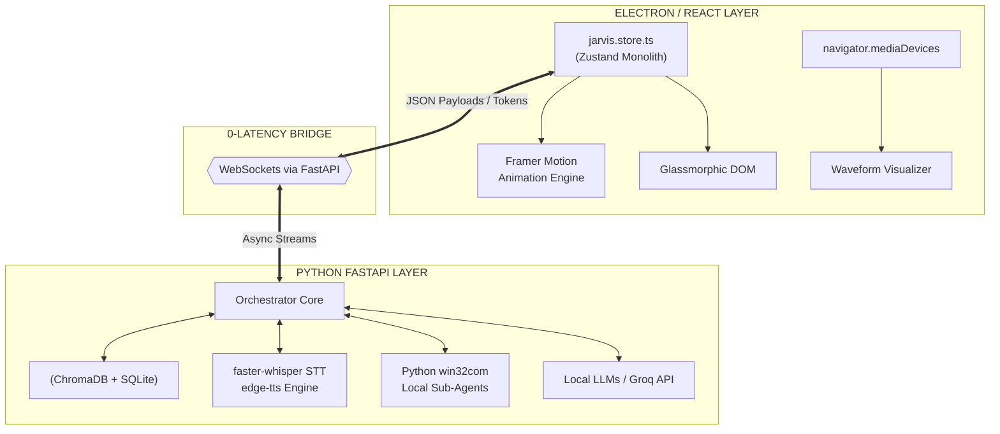

<div align="center">

<a href="https://github.com/Allen73737/astryx-ai-assistant">
  
</a>

<p align="center">
  <a href="#architecture"></a>
  <a href="#frontend-engine"></a>
  <a href="#state-management"></a>
  <a href="#backend-engine"></a>
  <a href="#voice-layer"></a>
  <a href="#data-layer"></a>
</p>

---

<table align="center" width="100%">
  <tr>
    <td align="center" width="50%">
      <h3><code>[ DIRECTIVE // ASTRYX ]</code></h3>
      Astryx isn't a chatbot wrapper. It is a <b>native, zero-latency desktop operating environment</b>. Bypassing generic conversational interfaces, it executes multi-agent swarms, spatial AR mapping, and native desktop automation (COM OLE) entirely within a hyper-fluid, dynamic glassmorphism HUD.
    </td>
    <td align="center" width="50%">
      <h3><code>[ CORE TELEMETRY ]</code></h3>
      <br>
      Latency ➔ <code>< 15ms Token Stream</code><br>
      UI FPS ➔ <code>120Hz Framer Motion</code><br>
      State Sync ➔ <code>Bi-Directional WS Sync</code><br>
      Storage ➔ <code>Chroma Vector + SQLite</code>
    </td>
  </tr>
</table>

</div>

<br>

## ▓▓▓▓▓▓▓▓▓▓▓▓▓▓▓▓▓▓▓▓▓▓▓▓▓▓▓▓▓▓▓▓▓▓▓▓▓▓▓▓▓▓▓▓▓▓▓▓▓▓▓▓▓▓▓▓▓▓▓▓▓▓▓▓▓▓▓▓▓▓
## ░░ 1. THE INTELLIGENCE MATRIX (MAIN FEATURES)                       ░░
## ▓▓▓▓▓▓▓▓▓▓▓▓▓▓▓▓▓▓▓▓▓▓▓▓▓▓▓▓▓▓▓▓▓▓▓▓▓▓▓▓▓▓▓▓▓▓▓▓▓▓▓▓▓▓▓▓▓▓▓▓▓▓▓▓▓▓▓▓▓▓

Astryx features a registry of over **50 autonomous heuristic sub-systems**, replacing standard desktop software with native AI counterparts.

<table width="100%">
  <tr>
    <td width="25%" align="center">
      <br>
      <code>[ AGENTIC SWARM CODING ]</code>
    </td>
    <td width="75%">
      An autonomous coding workspace injected directly into the HUD. It runs multi-agent LLM swarms that draft code, execute it in a local shell, intercept <code>stdout/stderr</code>, and autonomously self-correct failures without human intervention.
    </td>
  </tr>
  <tr>
    <td width="25%" align="center">
      <br>
      <code>[ REALTIME BUFFER MAP ]</code>
    </td>
    <td width="75%">
      Intercepts system/desktop audio and microphone inputs simultaneously using <code>navigator.mediaDevices</code>. Maps raw audio buffers onto an HTML5 Canvas sine-wave phase visualizer while running continuous transcription to synthesize smart meeting notes.
    </td>
  </tr>
  <tr>
    <td width="25%" align="center">
      <br>
      <code>[ WIN32COM AUTOMATION ]</code>
    </td>
    <td width="75%">
      Hijacks Microsoft PowerPoint via Python's <code>win32com.client</code>. Instead of writing text, Astryx physically manipulates the `.pptx` XML DOM, drawing premium gradients (Quantum Flux, Cyber Hologram) and shapes onto slides in real-time.
    </td>
  </tr>
  <tr>
    <td width="25%" align="center">
      <br>
      <code>[ AR OVERLAY PROTOCOL ]</code>
    </td>
    <td width="75%">
      Hooks into standard webcams to project an Augmented Reality neon isometric grid. It tracks bounds and depth, forcing the global <code>OrbState</code> into <code>ar_mode</code> to override standard UI boundaries.
    </td>
  </tr>
</table>

<br>

## ▓▓▓▓▓▓▓▓▓▓▓▓▓▓▓▓▓▓▓▓▓▓▓▓▓▓▓▓▓▓▓▓▓▓▓▓▓▓▓▓▓▓▓▓▓▓▓▓▓▓▓▓▓▓▓▓▓▓▓▓▓▓▓▓▓▓▓▓▓▓
## ░░ 2. GLASSMORPHIC UI & DYNAMIC THEMING                             ░░
## ▓▓▓▓▓▓▓▓▓▓▓▓▓▓▓▓▓▓▓▓▓▓▓▓▓▓▓▓▓▓▓▓▓▓▓▓▓▓▓▓▓▓▓▓▓▓▓▓▓▓▓▓▓▓▓▓▓▓▓▓▓▓▓▓▓▓▓▓▓▓

We built a **Dynamic Glassmorphism** design system powered entirely by raw CSS variables, `backdrop-filter`, and `framer-motion`. Zero generic Tailwind boilerplates were used. 

### 🟢 THE AI ORB ENGINE
The visual centerpiece is the AI Orb, programmed using intense SVG displacement maps (`<feTurbulence>` and `<feDisplacementMap>`). 
As `jarvis.store.ts` registers websocket events (`listening`, `processing`, `speaking`), the React frontend manipulates the `baseFrequency` and `numOctaves` of the SVG filter at 120Hz, creating a liquid, breathing intelligence.

### 🎨 THE HEX CORE (THEMES)
Astryx intercepts the `:root` pseudo-class to inject massive color shifts across the entire application instantly.

| MODE | STATUS | HEX PAYLOAD | AESTHETIC DESIGNATION |
| :--- | :--- | :--- | :--- |
| **CYAN** | `ONLINE` | ` #00E5FF` | The default, cold, high-intelligence layout. |
| **STEALTH** | `COVERT` | ` #111111` | Obsidian, high-contrast minimalist interface. |
| **EMERALD** | `METRICS`| ` #10B981` | System monitoring and Matrix telemetry. |
| **EMBER** | `WARNING`| ` #F59E0B` | Overclocked sub-routines or alert states. |
| **VIOLET** | `CREATIVE`| ` #A855F7` | Neural networks and creative generation. |

<br>

## ▓▓▓▓▓▓▓▓▓▓▓▓▓▓▓▓▓▓▓▓▓▓▓▓▓▓▓▓▓▓▓▓▓▓▓▓▓▓▓▓▓▓▓▓▓▓▓▓▓▓▓▓▓▓▓▓▓▓▓▓▓▓▓▓▓▓▓▓▓▓
## ░░ 3. TECHNICAL ARCHITECTURE (DEEP DIVE)                            ░░
## ▓▓▓▓▓▓▓▓▓▓▓▓▓▓▓▓▓▓▓▓▓▓▓▓▓▓▓▓▓▓▓▓▓▓▓▓▓▓▓▓▓▓▓▓▓▓▓▓▓▓▓▓▓▓▓▓▓▓▓▓▓▓▓▓▓▓▓▓▓▓

The codebase represents a masterclass in separating a heavy heuristic backend from a buttery-smooth client.



### `[ FRONTEND // ZUSTAND & ELECTRON ]`
React Context is too slow for 120Hz real-time token streaming. We utilize a massive **Zustand Monolithic Store** (`jarvis.store.ts`).
- **Independent Mutability**: When a token arrives via WebSockets, Zustand updates the `liveNotesContent` or `ideTerminalLogs` directly. The `BottomBar` executes re-renders independently without freezing the glowing Orb animations.
- **IPC Architecture**: Electron's `preload.js` strictly handles OS-level desktop window states (transparent overlays, always-on-top flags).

### `[ BACKEND // FASTAPI & VOICE ENGINE ]`
The Python backend handles heavy neural loads concurrently.
- **Bi-Directional Sockets (`websockets.py`)**: Standard HTTP REST is inadequate for AI. FastApi mounts a permanent WebSocket connection. LLM tokens, system metrics (CPU/VRAM), and tool execution flags are pushed instantly to the frontend.
- **Voice Engine (`voice_engine.py`)**: Implements strict `PyAudio` stream buffering. It uses **Voice Activity Detection (VAD)** to mathematically determine when silence happens, cuts the buffer, feeds it to `faster-whisper`, and replies using `edge-tts` within milliseconds.
- **Memory (`memory.py`)**: Every interaction is vectorized using embeddings and stored in **ChromaDB**. Astryx inherently remembers contexts from sessions ago using RAG retrieval techniques.

<br>

## ▓▓▓▓▓▓▓▓▓▓▓▓▓▓▓▓▓▓▓▓▓▓▓▓▓▓▓▓▓▓▓▓▓▓▓▓▓▓▓▓▓▓▓▓▓▓▓▓▓▓▓▓▓▓▓▓▓▓▓▓▓▓▓▓▓▓▓▓▓▓
## ░░ 4. SYSTEM INITIALIZATION & DEPLOYMENT                            ░░
## ▓▓▓▓▓▓▓▓▓▓▓▓▓▓▓▓▓▓▓▓▓▓▓▓▓▓▓▓▓▓▓▓▓▓▓▓▓▓▓▓▓▓▓▓▓▓▓▓▓▓▓▓▓▓▓▓▓▓▓▓▓▓▓▓▓▓▓▓▓▓

Follow the directive below to bypass local firewalls and initialize Astryx on your local machine.

### `[1]` CLONE REPOSITORY
```powershell
git clone https://github.com/Allen73737/astryx-ai-assistant.git
cd astryx-ai-assistant
```

### `[2]` DEPLOY FRONTEND ENGINE (ELECTRON / VITE)
```powershell
npm install
npm run dev
```

### `[3]` ESTABLISH BACKEND MATRIX (FASTAPI / PYTHON)
```powershell
# Open a secondary terminal instance
cd backend
python -m venv .venv

# Activate Virtual Environment (Windows)
.venv\Scripts\activate

# Install Dependencies
pip install -r requirements.txt

# Secure Credentials
# Rename .env.example to .env and input your API keys.
# Pydantic Settings handles secure ingestion dynamically via JARVIS_ prefixes.

# Ignite the Core
python main.py
```

<br>

---
<div align="center">
  
  <br>
  
</div>
