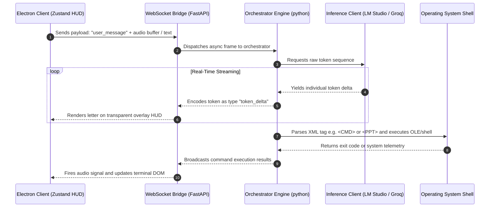

<div align="center">

```
  █████   █████████  ███████████  ███████████   █████   █████  █████   █████
 ░░███   ░░███░░░░░█ ░░███░░░░░███░░███░░░░░███ ░░███   ░░███  ░░███   ░░███ 
  ░███    ░███  █ ░   ░███    ░███ ░███    ░███  ░░███ ░███     ░░███ ███   
  ░███    ░██████     ░██████████  ░███████████   ░░░█████       ░░█████    
  ░███    ░███░░█     ░███░░░░░███ ░███░░░░░███    ░███░███       ░███░███   
  ░███    ░███ ░   █  ░███    ░███ ░███    ░███   ░███ ░░███     ███ ░░███  
  █████   ██████████  █████   █████████████████   █████ ░░█████ █████   █████
 ░░░░░   ░░░░░░░░░░  ░░░░░   ░░░░░░░░░░░░░░░░░   ░░░░░   ░░░░░ ░░░░░   ░░░░░ 
```

### `[ PROTOCOL ASTRYX // COGNITIVE MATRIX v1.1.0 ]`
*A Zero-Latency Local Intelligence Operating System, built on Transparent Glassmorphism & High-Frequency WebSockets.*

<br>

<p align="center">
  
  
  
</p>

---

<div style="border: 1px solid rgba(0, 229, 255, 0.2); border-radius: 12px; padding: 20px; background: rgba(5, 5, 5, 0.85); backdrop-filter: blur(25px); box-shadow: 0 8px 32px 0 rgba(0, 229, 255, 0.1);">
<h3 align="center" style="color: #00E5FF; margin-top: 0;">🌐 GLASSMORPHIC HUD TELEMETRY</h3>

Astryx bypasses traditional conversational AI wrappers, creating a native, zero-latency desktop operating environment. Utilizing high-frequency WebSockets to link our asynchronous Python backend directly with an Electron Chromium interface, Astryx renders a fully hardware-accelerated, transparent glassmorphic overlay onto your desktop.

* **UI Fluidity:** 120Hz framerate utilizing React & Framer Motion.
* **OS-Level Injection:** Native transparency, transparent window clicking, and focus overlays.
* **Low Memory Footprint:** Dynamic GGUF model caching and swap routines.
</div>

</div>

<br>

## ▓▓▓▓▓▓▓▓▓▓▓▓▓▓▓▓▓▓▓▓▓▓▓▓▓▓▓▓▓▓▓▓▓▓▓▓▓▓▓▓▓▓▓▓▓▓▓▓▓▓▓▓▓▓▓▓▓▓▓▓▓▓▓▓▓▓▓▓▓▓
## ░░ 1. COMPREHENSIVE INTELLIGENCE MATRIX (50+ ACTIVE FEATURES)     ░░
## ▓▓▓▓▓▓▓▓▓▓▓▓▓▓▓▓▓▓▓▓▓▓▓▓▓▓▓▓▓▓▓▓▓▓▓▓▓▓▓▓▓▓▓▓▓▓▓▓▓▓▓▓▓▓▓▓▓▓▓▓▓▓▓▓▓▓▓▓▓▓

Astryx's **Intelligence Matrix** is divided into 5 distinct operational nodes, housing 50+ supporting processes, utilities, and heuristic tools:

<div style="background: rgba(17, 17, 17, 0.6); backdrop-filter: blur(10px); border-radius: 8px; border: 1px solid rgba(168, 85, 247, 0.2); padding: 15px; margin-bottom: 20px;">

### 💻 A. SYSTEM CODING & RUNTIME SANDBOX (10 Features)
* **1. Antigravity IDE:** Monolithic editor framework featuring full workspace trees, active files, and diff highlights.
* **2. Multi-Agent Swarm Coding:** Spawns hierarchical sub-agents that draft code files and review them concurrently.
* **3. Secure Subprocess Sandbox (`code_sandbox.py`):** Runs compiled languages securely in a virtual subprocess.
* **4. Terminal Log Interceptor:** Captures execution logs, piping stdout/stderr straight back into the LLM context.
* **5. Self-Correction Loop:** Autonomously analyzes stack traces and rewrites faulty scripts until success status.
* **6. Code Explainer (`code_explainer.py`):** Deconstructs script blocks line-by-line, providing semantic explanations.
* **7. Automated Reviewer (`code_reviewer.py`):** Scores codebase vulnerabilities for security, style, and optimizations.
* **8. Interactive Compiler UI:** Render outputs of TypeScript, JS, HTML, or Python directly in the HUD.
* **9. Code Minifier Engine:** Compresses files to raw tokens, outputting real-time size comparison dials.
* **10. DevOps Console:** Integrates git/docker subprocess logs to track repository states and container pools.

</div>

<div style="background: rgba(17, 17, 17, 0.6); backdrop-filter: blur(10px); border-radius: 8px; border: 1px solid rgba(0, 229, 255, 0.2); padding: 15px; margin-bottom: 20px;">

### 🎙️ B. ACOUSTIC & SPEECH INTELLIGENCE (10 Features)
* **11. Live Audio Tracker:** Simultaneously listens to microphone and desktop system loops via browser APIs.
* **12. Vector Sine Wave Visualizer:** Renders high-fidelity sound visualizers on canvas at 60FPS.
* **13. Real-Time MD Synthesis:** Auto-summarizes active transcriptions into formatted markdown meeting notes.
* **14. Hardware Audio Mixer:** Custom volume interface scaling specific microphone input levels.
* **15. Voice Activity Detection (VAD):** Truncates silence frames locally to avoid server latency.
* **16. local Speech-to-Text (`faster-whisper`):** Direct token conversion using GGUF whisper models.
* **17. Voice Profile Selector:** Choose custom voice models ranging from casual to highly technical styles.
* **18. Pitch & Rate Modulation:** Injects fine-grain SSML parameters (`rate`, `pitch`) into local TTS engines.
* **19. Voice Learning Loop (`voice_learning.py`):** Adapts pronunciation maps to correct misheard syllables.
* **20. SSML Customizer:** Dynamically wraps spoken words with tags to modify emotional accentuation.

</div>

<div style="background: rgba(17, 17, 17, 0.6); backdrop-filter: blur(10px); border-radius: 8px; border: 1px solid rgba(16, 185, 129, 0.2); padding: 15px; margin-bottom: 20px;">

### 📊 C. PRODUCTIVITY & SYSTEM CONTROLS (10 Features)
* **21. PowerPoint OLE Generator (`ppt_generator.py`):** Programmatically drives Slide generation via PowerPoint's API.
* **22. Slide Design System Engine:** Applies premium layout matrices like "Quantum Flux" and "Stealth Obsidian" via COM.
* **23. PPT Merger (`ppt_merger.py`):** Joins presentation decks, building automated slide bridge transitions.
* **24. Social Crawler (`trend_learner.py`):** Scrapes Reddit, Behance, and Twitter for emerging global styles.
* **25. Trend Predictor (`trend_predictor.py`):** Evaluates crawler data using regression models to map trend lifespans.
* **26. Live HTML Dashboard Generator:** Instantly renders responsive charts, metrics, and cards.
* **27. Finance Tracker (`data_analyst.py`):** Charts budget and crypto holdings using SQLite database tables.
* **28. Health Tracker System:** Logs daily workout, hydration, and medication routines dynamically.
* **29. IoT Smart Home Interface:** Toggles and configures connected devices via HTTP/WS endpoints.
* **30. DevOps Command Router:** Manages local docker containers and git checkouts on visual overlays.

</div>

<div style="background: rgba(17, 17, 17, 0.6); backdrop-filter: blur(10px); border-radius: 8px; border: 1px solid rgba(245, 158, 11, 0.2); padding: 15px; margin-bottom: 20px;">

### 📐 D. SPATIAL VISUALIZATION & GRAPHICS (10 Features)
* **31. Spatial Wall Mapper:** Renders real-time isometric mesh projection lines over live webcam feeds.
* **32. Camera HUD Overlay:** Toggles overlays, mimicking LiDAR space sweeping scanners.
* **33. Dreamscape Simulator:** Spawns a canvas particle visualization mapping system resource states.
* **34. Starmap Navigation:** Interactive astronomical map simulation rendering coordinate paths.
* **35. Mood Mirror (`moodmirror`):** Real-time mood recognition mapping system telemetry with webcam filters.
* **36. Imagen Renderer (`image_generator.py`):** Injects generated art assets into PPT designs.
* **37. Particle Lab Sandbox (`particle_lab.py`):** Renders particle collisions using customized vector physics.
* **38. SVG Layout Composer:** Generates vector drawings locally when local image generators are offline.
* **39. Unsplash Cache Manager:** Pre-downloads stock photography matching computed design topics.
* **40. Screen Capture Inspector:** Grabs monitor frames to perform OCR and vision queries.

</div>

<div style="background: rgba(17, 17, 17, 0.6); backdrop-filter: blur(10px); border-radius: 8px; border: 1px solid rgba(239, 68, 68, 0.2); padding: 15px; margin-bottom: 20px;">

### 🧠 E. HEURISTIC CORE & UTILITIES (10 Features)
* **41. Context Router (`orchestrator.py`):** Spawns local LLMs or routes queries to external APIs.
* **42. Vector Graph Memory (`memory.py`):** Manages vector node clusters inside a local ChromaDB instance.
* **43. Smart Meeting Transcript:** Runs voice-to-text recording, creating decisions and task item lists.
* **44. Visual Workflow Builder:** Links daily actions (weather, schedule, code review) to visual node diagrams.
* **45. Multi-Persona Debate Arena:** Optimist, Skeptic, Strategist, Pragmatist agents debating user questions.
* **46. Proactive Monitor System:** Monitors CPU/VRAM load, giving recommendations on overlays.
* **47. Model Swapping Engine:** Caches GGUF weights, dynamically loading model routes to fit local VRAM sizes.
* **48. Keyboard Hook Daemon:** Translates hotkeys to prompt overlays instantly.
* **49. Clipboard Broker:** Programmatically intercepts text and code structures.
* **50. Schedule Alarm Daemon:** Sets recurring chron schedules, triggering OS system messages.

</div>

---

## ▓▓▓▓▓▓▓▓▓▓▓▓▓▓▓▓▓▓▓▓▓▓▓▓▓▓▓▓▓▓▓▓▓▓▓▓▓▓▓▓▓▓▓▓▓▓▓▓▓▓▓▓▓▓▓▓▓▓▓▓▓▓▓▓▓▓▓▓▓▓
## ░░ 2. COGNITIVE PIPELINE FLOW & DATA MAP                           ░░
## ▓▓▓▓▓▓▓▓▓▓▓▓▓▓▓▓▓▓▓▓▓▓▓▓▓▓▓▓▓▓▓▓▓▓▓▓▓▓▓▓▓▓▓▓▓▓▓▓▓▓▓▓▓▓▓▓▓▓▓▓▓▓▓▓▓▓▓▓▓▓

The bidirectional communication flow operates entirely over async message frames:



---

## ▓▓▓▓▓▓▓▓▓▓▓▓▓▓▓▓▓▓▓▓▓▓▓▓▓▓▓▓▓▓▓▓▓▓▓▓▓▓▓▓▓▓▓▓▓▓▓▓▓▓▓▓▓▓▓▓▓▓▓▓▓▓▓▓▓▓▓▓▓▓
## ░░ 3. DETAILED IMPLEMENTATION SCHEMAS                               ░░
## ▓▓▓▓▓▓▓▓▓▓▓▓▓▓▓▓▓▓▓▓▓▓▓▓▓▓▓▓▓▓▓▓▓▓▓▓▓▓▓▓▓▓▓▓▓▓▓▓▓▓▓▓▓▓▓▓▓▓▓▓▓▓▓▓▓▓▓▓▓▓

### 🎙️ The Acoustic Loop (`voice_engine.py`)
Our audio transcription bypasses standard web services. Raw sound is captured in a continuous ring buffer using `PyAudio`.

```python
# Raw VAD implementation snippet inside voice_engine.py
import pyaudio
import numpy as np

class AudioBufferStream:
    def __init__(self, rate=16000, chunk=1024):
        self.p = pyaudio.PyAudio()
        self.stream = self.p.open(
            format=pyaudio.paInt16,
            channels=1,
            rate=rate,
            input=True,
            frames_per_buffer=chunk
        )
        
    def read_frame_energy(self):
        data = self.stream.read(1024)
        audio_data = np.frombuffer(data, dtype=np.int16)
        energy = np.sqrt(np.mean(audio_data**2))
        return energy # Trigger transcription if energy passes VAD limit
```

### 💻 The Zustand HUD Store (`jarvis.store.ts`)
The entire client context is managed through Zustand. When WebSockets push states, it executes micro-updates to bypass React's standard component reconciliation latency.

```typescript
// Zustand Store slices inside src/renderer/src/stores/jarvis.store.ts
export const useJarvisStore = create<JarvisStore>((set) => ({
  orbState: 'standby',
  connectionStatus: 'disconnected',
  activeLab: null,
  liveNotesContent: '',
  setOrbState: (state) => set({ orbState: state }),
  appendNotes: (chunk) => set((s) => ({ liveNotesContent: s.liveNotesContent + chunk })),
  setActiveLab: (id) => set({ activeLab: id }),
}));
```

---

## ▓▓▓▓▓▓▓▓▓▓▓▓▓▓▓▓▓▓▓▓▓▓▓▓▓▓▓▓▓▓▓▓▓▓▓▓▓▓▓▓▓▓▓▓▓▓▓▓▓▓▓▓▓▓▓▓▓▓▓▓▓▓▓▓▓▓▓▓▓▓
## ░░ 4. SYSTEM BOOT STRATEGY (INSTALLATION)                         ░░
## ▓▓▓▓▓▓▓▓▓▓▓▓▓▓▓▓▓▓▓▓▓▓▓▓▓▓▓▓▓▓▓▓▓▓▓▓▓▓▓▓▓▓▓▓▓▓▓▓▓▓▓▓▓▓▓▓▓▓▓▓▓▓▓▓▓▓▓▓▓▓

Deploy the system sequentially to prevent port bindings or environment validation failures.

```powershell
# [Phase 1: Clone Repositories]
git clone https://github.com/Allen73737/astryx-ai-assistant.git
cd astryx-ai-assistant

# [Phase 2: Configuration]
# Populate backend/.env using backend/.env.example variables.
# Pydantic Settings parses these values into typed memory objects upon launch.

# [Phase 3: Electron Client Build]
npm install
npm run dev

# [Phase 4: FastAPI Server Init]
cd backend
python -m venv .venv
.venv\Scripts\activate
pip install -r requirements.txt
python main.py
```

<br>

---
<div align="center">
  
  <br>
  
</div>
