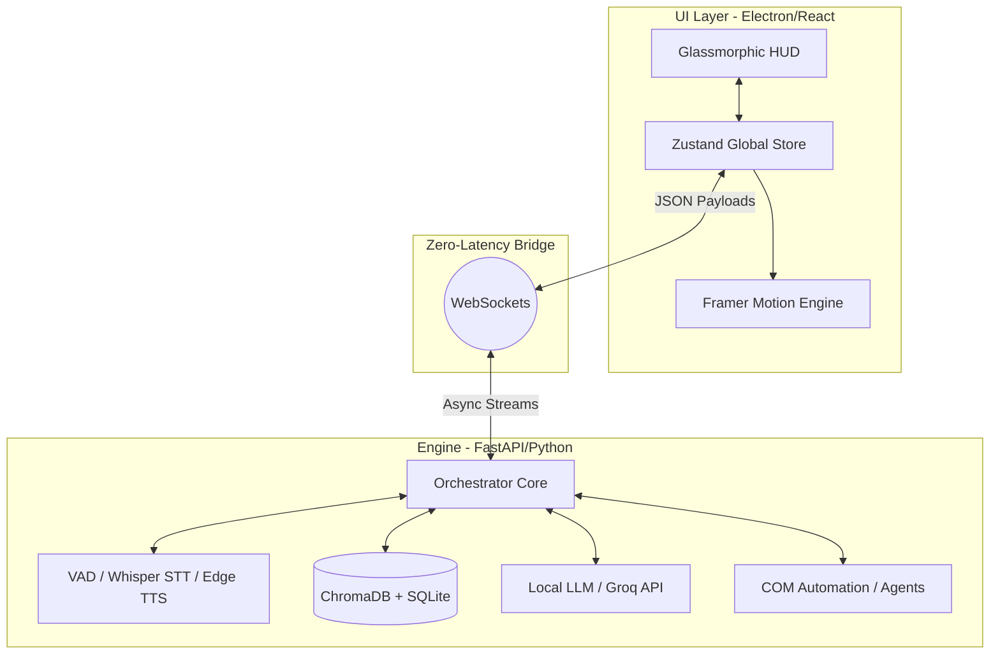

<div align="center">


**The intersection of spatial computing, autonomous AI, and glass-morphic UI.**

<p align="center">
  
  
  
  
  
  
  
</p>

</div>

---

## 💠 ARCHITECTURE OVERVIEW

Astryx isn't a wrapper; it's a natively built, bidirectional real-time system. The architecture is split between a hyper-optimized **React/Electron Frontend** and a highly concurrent **FastAPI/Python Backend**.



---

## 🔮 THE INTELLIGENCE MATRIX

Astryx houses an **Intelligence Matrix** comprising over 50 autonomous features, sub-agents, and heuristic tools. These aren't passive scripts—they are active agents that manipulate your operating system, learn from your habits, and generate assets on the fly.

<details>
<summary><b>1. Antigravity IDE (Agentic Swarm Coding)</b></summary>
<br>
A fully functional IDE embedded directly inside the Astryx HUD. 
<ul>
  <li><b>Swarm Execution:</b> Dispatches multiple LLM sub-agents to draft, refactor, and review code in parallel.</li>
  <li><b>Terminal Integration:</b> Runs shell commands natively, reading <code>stdout/stderr</code> directly back into the AI context window.</li>
</ul>
</details>

<details>
<summary><b>2. Spatial Wall Mapper (AR Mode)</b></summary>
<br>
Turns your webcam into a LiDAR-style spatial scanner.
<ul>
  <li><b>Implementation:</b> Uses HTML5 Canvas and React refs to project an isometric, neon-grid overlay onto live video feeds.</li>
  <li><b>State Management:</b> Forces the global <code>OrbState</code> into <code>ar_mode</code>, overriding standard UI elements with a HUD overlay.</li>
</ul>
</details>

<details>
<summary><b>3. Live Audio Tracker</b></summary>
<br>
A real-time transcription and synthesis lab tool.
<ul>
  <li><b>Audio Capture:</b> Hooks into <code>navigator.mediaDevices.getDisplayMedia()</code> for system audio and <code>getUserMedia()</code> for microphone input.</li>
  <li><b>Visualizer:</b> Uses the Canvas API to draw a reactive sine-wave phase visualizer representing the audio buffer.</li>
  <li><b>Synthesis:</b> Auto-generates markdown summaries from the incoming audio stream and exports directly to your local file system.</li>
</ul>
</details>

<details>
<summary><b>4. PPT Designer (COM Automation)</b></summary>
<br>
A true desktop agent that builds presentations in real-time.
<ul>
  <li><b>Implementation:</b> The Python backend uses the <code>win32com.client</code> library to interface directly with Microsoft PowerPoint via OLE Automation.</li>
  <li><b>Design System:</b> Features premium layouts (Quantum Flux, Cyber Hologram) by injecting custom RGB gradients, shapes, and typography directly into the `.pptx` XML DOM.</li>
</ul>
</details>

---

## 🎨 UI & AESTHETIC IMPLEMENTATION

The Astryx UI breaks away from generic chat boxes, utilizing a **Dynamic Glassmorphism** design system powered by CSS variables and `framer-motion`.

- **The AI Orb:** The centerpiece of the application. The Orb visually reflects the AI's state (`standby`, `listening`, `processing`, `speaking`, `executing`). It utilizes SVG filters (turbulence, displacement maps) to create a liquid, breathing aesthetic.
- **Fluid Themes:** The UI instantly transitions between themes via `Zustand` state injection.
  - 💧 `Cyan` (Default)
  - 🔮 `Violet` (Neural)
  - 🌿 `Emerald` (System/Matrix)
  - 🔥 `Ember` (Warning/Override)
  - ⬛ `Stealth` (Obsidian Minimalist)
- **HUD Mode:** The UI can collapse from a full-screen command center into a hyper-minimal, distraction-free floating bar (`hudMode: 'minimal'`).

---

## 🛠️ TECHNICAL STACK DEEP DIVE

### **Frontend Infrastructure**
- **Electron & Vite:** Extremely fast HMR (Hot Module Replacement) and native OS access.
- **Zustand (jarvis.store.ts):** A monolithic but highly organized state store. It handles WebSocket connection status, AI dialogue history, active Lab Tools, and global UI overrides without React Context re-render lag.
- **Framer Motion:** Every single component in Astryx—from the Bottom Bar execution field to the side panel transitions—is wrapped in `<motion.div>` with custom cubic-bezier easing for ultra-premium fluidity.

### **Backend Infrastructure**
- **FastAPI:** Handles HTTP initialization and WebSocket mounting.
- **Bi-Directional WebSockets:** Instead of waiting for REST responses, the backend streams tokens, tool execution statuses, and system telemetry live to the React frontend.
- **ChromaDB:** Local vector database for long-term memory and RAG (Retrieval-Augmented Generation).
- **Voice Engine:** Custom wrapper around `faster-whisper` for Voice Activity Detection (VAD) and `edge-tts` for sub-second text-to-speech rendering, managed via `pygame` audio channels.

---

## ⚙️ DEPLOYMENT & INITIALIZATION

> [!IMPORTANT]
> Ensure you are running Python 3.10+ and Node 18+.

**1. Clone & Setup**
```bash
git clone https://github.com/Allen73737/astryx-ai-assistant.git
cd astryx-ai-assistant
```

**2. Configure Environment**
Rename `backend/.env.example` to `backend/.env` and securely insert your API keys (Groq, Unsplash, etc.). Astryx uses `pydantic-settings` to safely inject these at runtime.

**3. Launch Frontend**
```bash
npm install
npm run dev
```

**4. Launch Backend**
```bash
cd backend
python -m venv .venv
source .venv/Scripts/activate  # Windows
pip install -r requirements.txt
python main.py
```

---

<div align="center">
  
</div>
