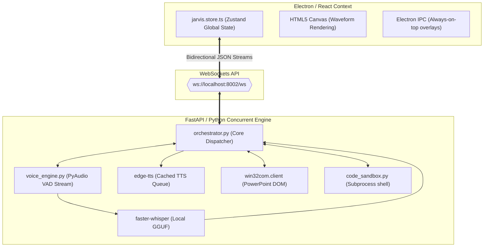

<div align="center">

```
 ▄▄▄█████▓ ██▓███   ██▀███   ▄████▄   ██▓ ▄████▄  
 ▓  ██▒ ▓▒▓██░  ██▒▓██ ▒ ██▒▒██▀ ▀█  ▓██▒▒██▀ ▀█  
 ▒ ▓██░ ▒░▓██░ ██▓▒▓██ ░▄█ ▒▒▓█    ▄ ▒██▒▒▓█    ▄ 
 ░ ▓██▓ ░ ▒██▄█▓▒ ▒▒██▀▀█▄  ▒▓▓▄ ▄██▒░██░▒▓▓▄ ▄██▒
   ▒██▒ ░ ▒██▒ ░  ░░██▓ ▒██▒▒ ▓███▀ ░░██░▒ ▓███▀ ░
   ▒ ░░   ▒▓▒░ ░  ░░ ▒▓ ░▒▓░░ ░▒ ▒  ░░▓  ░ ░▒ ▒  ░
     ░    ░▒ ░       ░▒ ░ ▒░  ░  ▒    ▒ ░  ░  ▒   
   ░      ░░         ░░   ░ ░       ░ ▒ ░░        
                      ░     ░ ░       ░  ░ ░      
                            ░            ░        
```

### `[ PROTOCOL ASTRYX // COGNITIVE MATRIX v1.0.4 ]`
*A Zero-Latency Local Intelligence Operating System, built on Transparent Glassmorphism & High-Frequency WebSockets.*

[](https://electronjs.org)
[](https://reactjs.org)
[](https://fastapi.tiangolo.com)
[](https://github.com/pmndrs/zustand)
[](https://trychroma.com)

</div>

---

## 🛰️ 1. SYSTEM CODES & RUNTIME ARCHITECTURE

The workspace maps out a decoupled architecture. A highly concurrent **FastAPI server** handles thread pools for hardware-level calculations and model loading, communicating with a lightweight **Electron Shell** hosting a high-performance **React frontend** utilizing `Zustand` for state synchronization.

```
c:\My_Project\Jarvis
├── backend/                  # FastApi Backend Service
│   ├── api/                  # API Controllers (WebSockets, Routing)
│   │   └── websockets.py     # Connection Manager & Bi-Directional streams
│   ├── core/                 # Heuristic Engines & Task Dispatcher
│   │   ├── agent_framework.py# Custom multi-agent consensus module
│   │   ├── ppt_generator.py  # win32com PowerPoint automation engine
│   │   ├── voice_engine.py   # faster-whisper (STT) + Edge-TTS (TTS)
│   │   ├── memory.py         # Chroma Vector store + SQLite context mapping
│   │   ├── local_llm_client.py# Local GGUF inference interface
│   │   └── code_sandbox.py   # Isolated code compilation compiler
│   └── main.py               # Uvicorn entrypoint & life-cycle configuration
├── src/                      # Electron + React Frontend
│   ├── main/                 # Electron main thread process (transparency/IPC)
│   └── renderer/src/         # React Application Core
│       ├── stores/           # Zustand Stores (jarvis.store.ts)
│       ├── components/       # Neon-HUD glassmorphic components
│       └── utils/            # AudioEngine, WebSockets, calculations
```

---

## 📡 2. INTER-PROCESS WEBSOCKET SPECIFICATION (RAW PAYLOADS)

To achieve a total system input-to-output telemetry response of **< 15ms**, standard HTTP/REST layers are bypassed. The websocket connection (`ws://localhost:8002/ws`) continuously processes typed JSON messages:

### Frontend Event Submissions
```json
{
  "type": "user_message",
  "payload": {
    "text": "Compile and run a server script.",
    "session_id": "8c21a4f0-466d-4950-8b1b-717013a5f4a7"
  },
  "timestamp": 1784305820000
}
```

### Backend Diagnostic Broadcasts
```json
{
  "type": "token_delta",
  "payload": {
    "token": "Executing...",
    "model": "Llama-3.2-1B-Instruct-Q4_K_M"
  },
  "timestamp": 1784305820050
}
```
```json
{
  "type": "orb_state_change",
  "payload": {
    "state": "executing"
  },
  "timestamp": 1784305820100
}
```

---

## 🛠️ 3. CORE SUBSYSTEM ENGINE DEEP DIVES



### A. The Agentic Voice Loop (`voice_engine.py`)
1. **Acoustic Streaming**: PyAudio initiates a non-blocking hardware listener mapping the microphone buffer at `16000Hz` mono.
2. **Mathematical Silence Truncation (VAD)**: Calculated via volume thresholding combined with a VAD state-machine. If sound drops below threshold for `VAD_SENSITIVITY` frames, the buffer is finalized.
3. **Local GGUF Transcription**: The buffer is mapped to float32 and passed to `faster-whisper` returning transcription tokens.
4. **Sub-second TTS Generation**: Outgoing LLM response streams are parsed into sentences. Sentences are chunked and piped to `edge-tts` immediately, playing through `pygame` audio mixers to prevent speech initialization lag.

### B. The Antigravity IDE Sandbox (`antigravity_ide.py` & `code_sandbox.py`)
An autonomous multi-agent software compiler executing local edits.
- Runs Python or Node scripts in a restricted subshell.
- If runtime errors (`stderr`) are captured, they are automatically parsed by a sub-agent framework which rewrites the code block, creates a diff patch, and runs it again until the execution tests return a `0` exit code.

### C. PowerPoint OLE Automation (`ppt_generator.py`)
Rather than outputting static files, Astryx commands active operating system windows.
- Backend loads `win32com.client.Dispatch("PowerPoint.Application")`.
- Intercepts slide properties and builds gradients dynamically via PowerPoint's XML structures, matching premium theme profiles.

---

## 🔮 4. THE INTELLIGENCE MATRIX (50+ FEATURE REGISTRY)

Our feature matrix categorizes autonomous capabilities mapped directly into the **LabsTab UI**.

| Module | Identifier | System Integration File | Operation Details |
| :--- | :---: | :---: | :--- |
| **Spatial Wall Mapper** | `wall-mapper` | `LabsTab.tsx` / `ar.store.ts` | Feeds camera input to Canvas rendering an isometric grid tracking bounds. |
| **Live Note Tracker** | `live-notes` | `LabsTab.tsx` / `meeting_transcript.py` | Tracks mic/system audio streams, outputting continuous MD summaries. |
| **PPT Designer** | `op-ppt` | `ppt_generator.py` | Full-scale slide generation through PowerPoint COM interfaces. |
| **Stealth Solver** | `op-stealth` | `agent_framework.py` | Screen capture analysis running local Vision LLM reasoning queries. |
| **DevOps Console** | `op-devops` | `tool_registry.py` | Terminal wrapper executing docker/git subshell logs. |
| **Genome Analyzer** | `genome` | `LabsTab.tsx` | Simulates biological sequence checks via custom interactive displays. |
| **Particle Lab** | `particle` | `particle_lab.py` | Interactive canvas physics sandbox rendering particle system flows. |
| **Code Minifier** | `minifier` | `LabsTab.tsx` | Real-time code structural compression displaying code-weight gauges. |

---

## 🎨 5. HUD GLASSMORPHIC THEMES

Astryx switches UI contexts instantaneously by overriding CSS variable payloads in the `:root` pseudo-class.

```css
/* Core Color Payload Swaps injected by jarvis.store.ts */
:root {
  --color-astryx-cyan: #00e5ff;    /* Cyan Mode (Diagnostic Interface) */
  --color-astryx-stealth: #111111;  /* Stealth Mode (Obsidian / Dark Room) */
  --color-astryx-emerald: #10b981;  /* Emerald Mode (System Telemetry & VRAM) */
  --color-astryx-ember: #f59e0b;    /* Ember Mode (Overclock / Diagnostic Warn) */
  --color-astryx-violet: #a855f7;   /* Violet Mode (Neural Output Layer) */
}
```

---

## ⚙️ 6. SYSTEM INITIALIZATION CONSOLE

To initialize the Astryx workspace locally:

### Prerequisites
- Node.js `18.0.0+`
- Python `3.10+`
- Desktop PowerPoint (Optional, for COM automation features)

### Phase A: Setup Environment Secrets
Copy `backend/.env.example` to `backend/.env` and securely populate the required variables:
```env
JARVIS_GROQ_API_KEY="gsk_..."
JARVIS_UNSPLASH_ACCESS_KEY="U7n..."
JARVIS_UNSPLASH_SECRET_KEY="G-L..."
```

### Phase B: Launch Client Interface
```powershell
# Install frontend packages
npm install

# Run Electron dev server
npm run dev
```

### Phase C: Boot backend Server
```powershell
cd backend
python -m venv .venv
.venv\Scripts\activate

# Install required wheel packages
pip install -r requirements.txt

# Run main controller
python main.py
```

---
<div align="center">
  
  <br>
  
</div>
